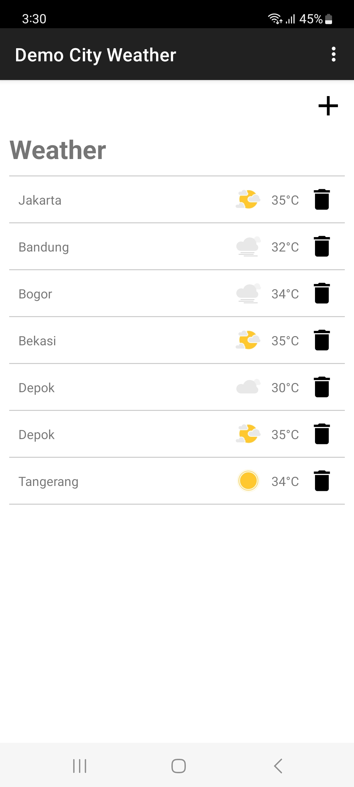
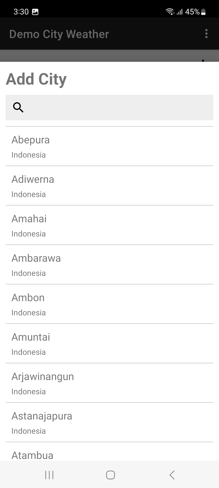
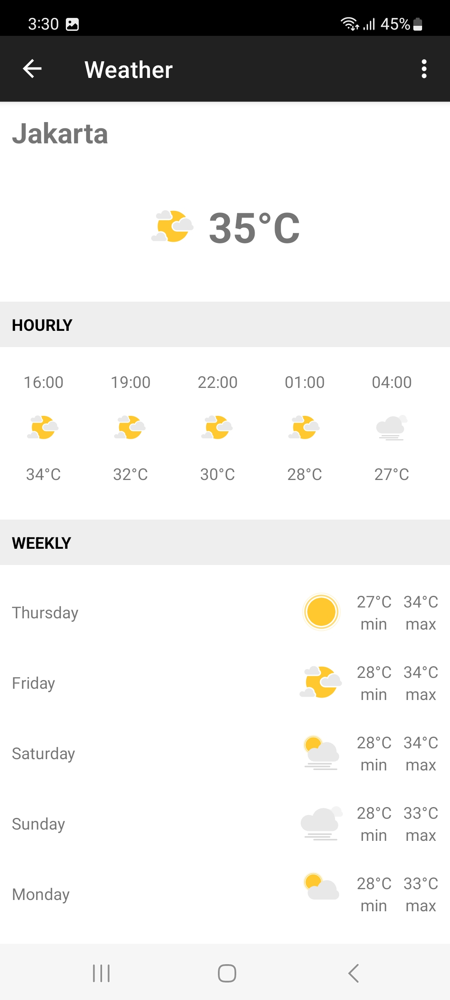

# DemoCityWeather-Android

**Screenshots:**
|  |  |  |
| -------------------------------------------------- | ----------------------------------------- | ----------------------------------------- |

**Technology Stack:**
- Kotlin Programming Language
- Clean Architecture
- MVVM Architecture Pattern
- Hilt Dependency Injection
- Navigation Graph
- View Binding, Data Binding
- ViewModel
- LiveData
- ROOM Database
- Retrofit REST + OkHttp
- Coroutine
- RxKotlin
- GSON Serialization
- Lottie
- Unit Test: JUnit, Mockito, MockWebServer, Robolectric
- Code Coverage: JaCoCo
- Gradle build flavors
- BuildSrc + Kotlin DSL
- Proguard
- Git

**To run the project in DEBUG MODE:**

Get the api key from [openweathermap.org](https://openweathermap.org/).

Create file namely “key.properties” in the root project with following contents:

storePassword=<your_keystore_password>  
keyPassword=<your_key_password>  
keyAlias=<your_key_alias>  
storeFile=<path_to_keystore_file>  
apiKey=<your_api_key>  

once you have created it, open the project with Android Studio, build the project and run the project.
